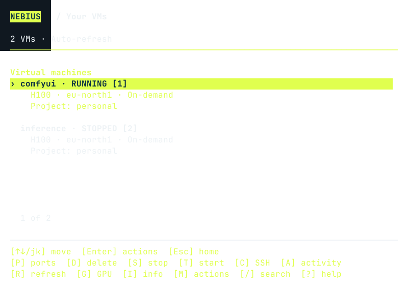
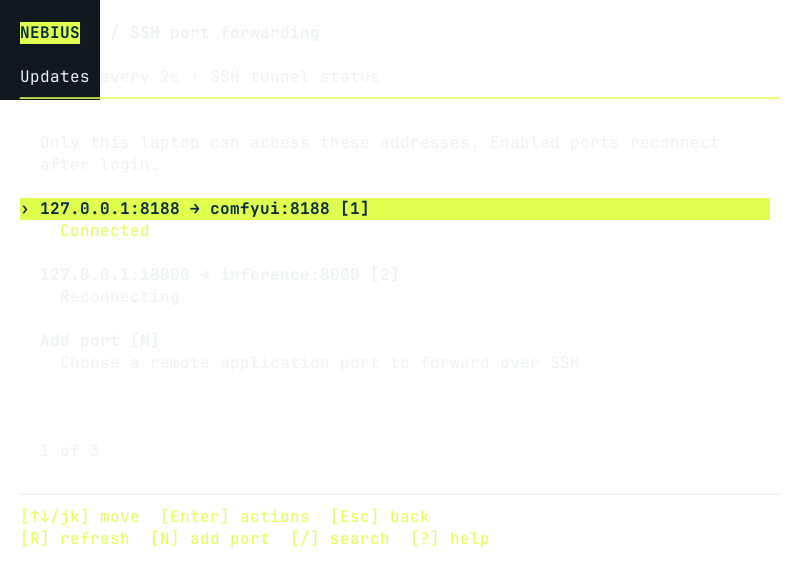
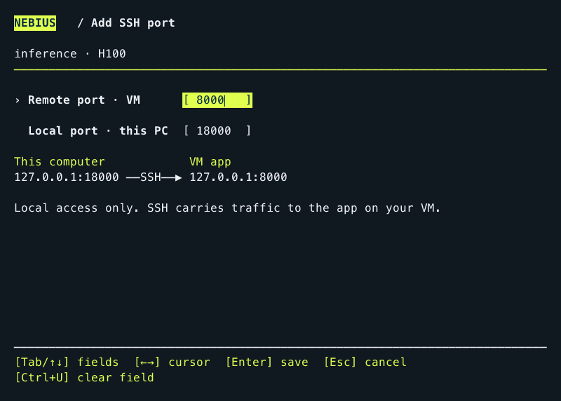
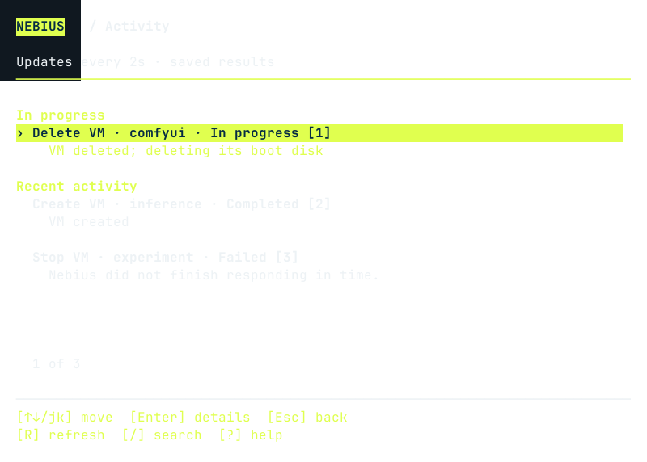

<p align="center">
  
</p>

<h1 align="center">Need a bigger GPU? Hit a key.</h1>

<p align="center">
  <strong>Simple launch. Simple SSH. Simple port forwarding.</strong><br>
  Nebius cloud GPUs, a few keystrokes from your Omarchy desktop.
</p>

<p align="center">
  <a href="#install"></a>
  <a href="#use-your-agent"></a>
  <a href="LICENSE"></a>
  <a href="https://github.com/antongisli/omarchy-nebius/actions/workflows/check.yml"></a>
</p>


*Screenshots use the real interface with example data. Availability depends on your account.*

Out of VRAM in **ComfyUI**? Trying a bigger model with **vLLM** or **Open WebUI**? Get a cloud GPU without leaving your Omarchy workflow.

## ✨ What you get

- ⚡ **GPU first.** Compare types, regions and availability. Toggle on-demand or preemptible with **P**.
- ⌨️ **Keyboard-native.** Launch, SSH, start, stop and review deletion. No command strings to memorize.
- 🔌 **Your app, at localhost.** Saved SSH port forwards reconnect after sleep or network changes.
- 📊 **Know what's running.** A live VM-count badge, background progress and persistent results.
- 🤖 **Ask your agent.** Nebius tools for both Codex and Claude Code.
- 🛡️ **Review before launch.** Preflight checks, price estimates and confirmation before creating resources.

You get a **CUDA-ready Ubuntu VM**; you install the apps and models. Choose your GPU first, then a personal project—or create one with an editable suggested name.

### ⚡ Use the validated fast H100 image

The normal plugin uses Nebius's public Ubuntu 24.04 / CUDA 13 family. If your
Nebius account can read Anton's validated v4b image, opt into it once:

```bash
~/.config/omarchy/plugins/nebius/bin/nebius-image fast-h100
```

Then choose a **single H100 in `eu-north1`**. The launch review must show
`image-boost-dev-h100-v4b-20260912` and a **256 GiB SSD**. Other GPUs and regions
continue to use the public image and 200 GiB default. Preflight blocks before
allocating a disk if the exact image is inaccessible. Return entirely to the
public family with `nebius-image public`.

If you import a released image into your own project, configure the resulting
ID directly:

```bash
~/.config/omarchy/plugins/nebius/bin/nebius-image set \
  computeimage-YOUR_ID eu-north1 gpu-h100-sxm 256
```

`nebius-image status` shows the current local selection. The plugin checks the
configured image live during preflight and uses it only for the matching region
and platform.

The optimized image recorded **10.759 seconds kernel-to-systemd startup** in one
fresh H100 launch. It does not remove VM allocation or first-use disk preparation,
which can dominate total launch time. The image currently belongs to the
`antons-party` project; repository access does not grant image access. See the
[image repository and access options](https://gitlab.nebius.dev/anton-smith/nebius-image-boost).
The proposed setup-time opt-in and first-use import flow is documented in the
[fast-image import design](docs/fast-image-import.md); it is not implemented or
advertised as available yet.

<a id="install"></a>

## 🚀 Install

You'll need **Omarchy Quattro with plugin support** and a **Nebius account** with compute quota. GPU availability varies.

```bash
omarchy plugin add https://github.com/antongisli/omarchy-nebius --enable
```

1. Open the lime **Nebius** icon in your bar → **Set up Nebius**.
2. Follow the terminal prompts and sign in through your browser.
3. Press **G** to choose a GPU, review the estimate and launch.

Setup installs **uv**, a checksum-verified **Nebius CLI**, pinned **official Nebius MCP**, and a dedicated SSH key. Package installation may ask for your password. [Setup details →](docs/reference.md#what-setup-does)

[Create an account](https://console.nebius.com/) · [GPU pricing](https://nebius.com/prices)

## ⌨️ Hit a key

From the Nebius panel:

| Key | Action | Key | Action |
| --- | --- | --- | --- |
| **G** | Get a GPU | **P** | Port forwarding |
| **J** | Jump into a VM | **A** | Activity |
| **V** | Your VMs | **S** | Set up / reconnect |
| **C** | GPU capacity | **U** | Uninstall plugin |

Navigate with **arrows / j/k**, **Enter** and **Esc**. **/** searches; **?** shows help. In the terminal, Jump is **Shift+J**. In GPU menus, **P** switches allocation type.

**Super+Ctrl+M** opens Nebius after setup, wherever its icon sits. Change it with **Shift+K · Shortcuts** in the panel or manager: arrows choose modifiers, type a key, Enter saves. Occupied keys are left alone. Optional [direct GPU / SSH bindings →](config/keybindings.lua)



## 🔌 Remote GPU. Local URL.

Start your app on the VM, then choose **P · Port forwarding → N · Add port**. Pick the VM and set both ports in one form; **Tab** moves between them.

An app on VM port **8188** can open at **http://127.0.0.1:8188** on your desktop. Traffic goes through encrypted SSH, with no public app port to open.



Forwards survive closing the menu and reconnect after sleep. **Connected** means the tunnel is ready—not that the app is running. [Port forwarding guide →](docs/reference.md#ssh-port-forwarding)

<a id="use-your-agent"></a>

## 🤖 Or just ask

Setup adds Nebius tools to installed **Codex** and **Claude Code** agents. Sign in to your agent and start a new session, then try:

> Show me GPU availability by region.

> Get me a GPU for vLLM. Show the options and cost before creating anything.

Billable and destructive actions require approval. **Agents are optional**—the keyboard interface works without one. Agent billing is separate from Nebius compute.

<details>
<summary>📸 More screenshots</summary>

**One form for both ports**



**Progress and results in Activity**



</details>

## 🧹 Update & uninstall

**Update:** `omarchy plugin update nebius`, then reopen Nebius terminals and agent sessions.

**Uninstall:** choose **U · Uninstall Nebius plugin**, ask your Nebius-connected agent, or run:

```bash
~/.config/omarchy/plugins/nebius/bin/nebius-uninstall
```

Same cleanup, no Omarchy hook required. Choose whether to keep the CLI, SSH key and uv. **Don't use bare `omarchy plugin remove nebius` on older Omarchy:** it leaves local setup behind. [Removal & recovery →](docs/reference.md#uninstall-and-reinstall)

> ⚠️ **Stop VMs when you're done—there is no auto-stop.** Disks remain billable after stopping. Uninstalling leaves all cloud resources unchanged; charges can continue.

## 🛠️ Public beta

Found a rough edge? [Open an issue](https://github.com/antongisli/omarchy-nebius/issues). Contributions welcome.

[Release notes](CHANGELOG.md) · [Full reference](docs/reference.md) · [Contributing](docs/development.md) · [Roadmap](docs/roadmap.md)

Maintained by [Anton Smith](https://github.com/antongisli). Official Nebius CLI + MCP; no `other-tool` dependency. [MIT code](LICENSE) · [Brand credits](assets/NOTICE.md)
