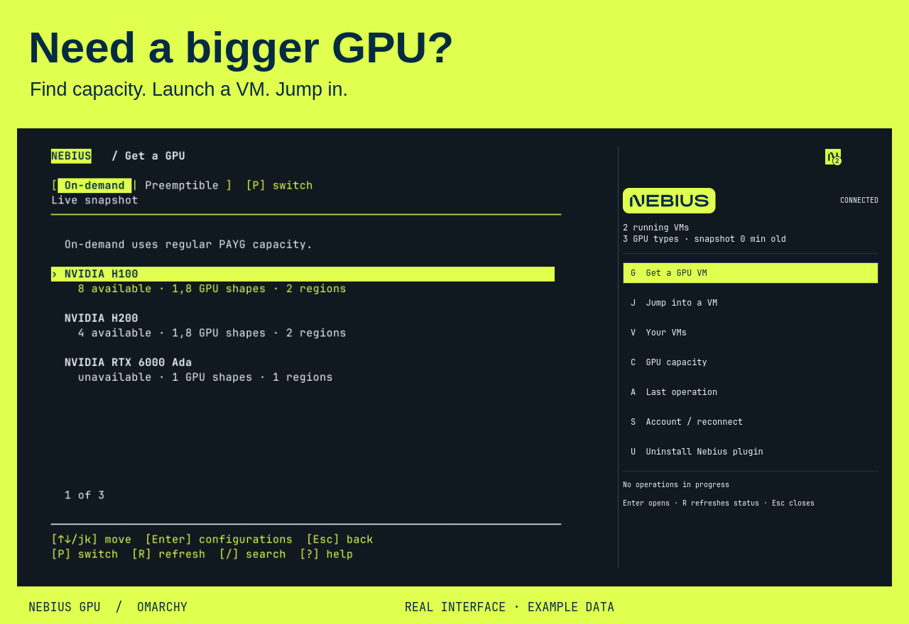

<p align="center">
  
</p>

<h1 align="center">Need a bigger GPU?</h1>

<p align="center">
  <strong>Find capacity. Launch a VM. Jump in.</strong><br>
  Nebius cloud GPUs, a few keystrokes from your Omarchy desktop.
</p>

<p align="center">
  <a href="#install"></a>
  <a href="#use-your-agent"></a>
  <a href="LICENSE"></a>
  <a href="https://github.com/antongisli/omarchy-nebius/actions/workflows/check.yml"></a>
</p>



*Preview rendered from the plugin interface with example data. GPU availability is checked in your account.*

Out of VRAM in **ComfyUI**? Want to try a larger model with **vLLM**, or connect **Open WebUI** to your own model server? Your desktop doesn't have to be the limit.

**Nebius GPU** brings cloud GPU discovery and VM management into Omarchy. Choose a GPU and region, review the cost and configuration, then open an SSH session. Keep your keyboard workflow while running the workload on a bigger machine.

The plugin gets you a CUDA-ready Ubuntu VM. You install your application and models on it; app templates and automatic workload migration are not included in this release.

## From “out of memory” to a machine you can use

| You want to… | The plugin helps you… |
| --- | --- |
| Run a workflow that no longer fits locally | Compare GPU families and regional availability before choosing a VM. |
| Try a new model or benchmark vLLM | Launch a CUDA-ready machine with an editable name and a dedicated SSH key. |
| Keep experimenting without losing your place | Jump back into running VMs; see state and ongoing operations from Omarchy. |
| Choose cost versus interruption risk | Switch between on-demand and preemptible, with price estimates and configuration review. |
| Keep cloud housekeeping manageable | Start or stop VMs, inspect storage, and explicitly delete plugin-managed VMs and boot disks. |

GPU choice comes first. Project placement comes afterward, with your personal projects preferred and an editable project proposal when you need one in another region.

## Install

Requires **Omarchy Quattro with plugin support**, a Nebius account, and access to billable compute. GPU availability and your account's quota determine what you can launch.

```bash
omarchy plugin add https://github.com/antongisli/omarchy-nebius --enable
```

Open the lime Nebius icon in your bar and choose **Set up Nebius**. A normal tiled terminal guides you through dependency installation, browser sign-in, project discovery and SSH setup. It checks installed **Codex** and **Claude Code** agents and adds Nebius tools to both when present.

An agent is optional for the keyboard interface. For natural-language requests, install and sign in to either supported agent through Omarchy, then run setup again.

New to Nebius? [Create an account](https://console.nebius.com/) · [Check GPU pricing](https://nebius.com/prices)

<details>
<summary>What gets installed?</summary>

- **uv**, from Arch's official repository through `omarchy-pkg-add uv`. The visible package installer may ask for your password.
- **Nebius CLI 0.12.269**, installed in your home directory after checksum verification.
- **Official Nebius MCP**, pinned to commit `6388bf779acdd331d9b2016230b37f8bf7177e12` and cached privately. Its runtime requires Python 3.13+; uv provisions the environment.
- A dedicated **browser-auth profile** and **SSH key** for this plugin.
- A constrained **`nebius` MCP registration** in each installed supported agent. Conflicting registrations are never overwritten.

Omarchy supplies the ordinary terminal tools used by setup, including Python, Bash, jq, curl, OpenSSH, fzf, gum and util-linux. No shell profile is edited. [Full setup and security details](docs/reference.md).

</details>

## Stay on the keyboard

| Key in the Nebius panel | Action |
| --- | --- |
| **G** | Get a GPU: choose → review → create |
| **J** | Jump into a running VM |
| **V** | Your VMs: overview and lifecycle actions |
| **C** | GPU capacity by family and region |
| **A** | Follow progress or inspect the last result |
| **S** | Set up or reconnect your account |
| **U** | Uninstall Nebius plugin |

Inside the terminal, use **arrows** or **j/k**, **Enter**, **Esc**, **/** to search, and **?** for help. GPU menus show an **On-demand / Preemptible switch at the top**: **P** toggles the highlighted option and updates the displayed availability; **R** fetches a fresh capacity snapshot. The terminal manager uses **Shift+J** for Jump because lowercase **j** moves down.

Before setup, the bar shows only the Nebius icon. After setup, a small **running VM count badge** appears on the icon: **0–9**, then **9+**, with the exact count in the tooltip. An unknown or stale count displays **?**, so failed refreshes never look like an empty account. Middle-click the icon to jump into a VM.

For direct desktop shortcuts, add the optional [Super+Ctrl+G/J/M bindings](config/keybindings.lua) after checking for conflicts with your existing bindings.

## Use your agent

Setup detects your Omarchy default agent, checks sign-in, and registers the same constrained tools with installed **Codex and Claude Code**. Start a new agent session after setup, then try:

> Show me GPU availability by region.

> I need a GPU for a vLLM experiment. Show me options and the estimated cost before creating anything.

> List my running VMs and help me connect to one.

The tools cover capacity, project placement, planning, VM creation and lifecycle, and SSH. Billable and destructive operations require approval. The agent's own subscription or API billing is separate from Nebius compute billing.

## Know what is happening

- **Preflight before allocation.** Check capacity advice, GPU and disk quota, image, subnet, allocation eligibility and request syntax before a VM launch allocates a disk.
- **Review before billing.** See the machine, project, allocation, boot disk and available price estimate before confirmation.
- **Progress that survives the window.** A submitted launch continues in the background. Reopen activity to see its result or error.
- **Failures stay visible.** Uncertain launches have recovery actions. Retained boot disks stay available for reuse or explicit cleanup.
- **Reconnect when needed.** Expired Nebius sessions prompt browser sign-in; there is no service-account setup.

Preflight is not a capacity reservation or a guarantee of permissions. Stop VMs manually when finished: **auto-stop is not included**. Stopped VMs retain billable storage until the disks are deleted.

## Remove or reinstall

Choose **U · Uninstall Nebius plugin** for the full local cleanup. You can keep the CLI for faster reinstall and keep the SSH key to preserve access to existing VMs.

**Cloud resources remain unchanged and may keep costing money.** Removing the plugin does not stop or delete VMs, disks, projects or networks. Direct `omarchy plugin remove nebius` removes the widget bundle only; use the plugin's uninstall action to also remove its local setup.

## Project status

Early release for Omarchy Quattro. Built and checked on a real Omarchy desktop, with regression coverage for keyboard navigation, narrow terminals, preflight failures and resource cleanup. [Development guide](docs/development.md) · [Known limits and implementation details](docs/reference.md) · [Report an issue](https://github.com/antongisli/omarchy-nebius/issues)


Maintained by [Anton Smith](https://github.com/antongisli). Uses the official Nebius CLI and MCP and has no dependency on the separate `other-tool` integration. Code is [MIT licensed](LICENSE); Nebius marks remain the property of their owners. [Brand asset sources](assets/NOTICE.md).
